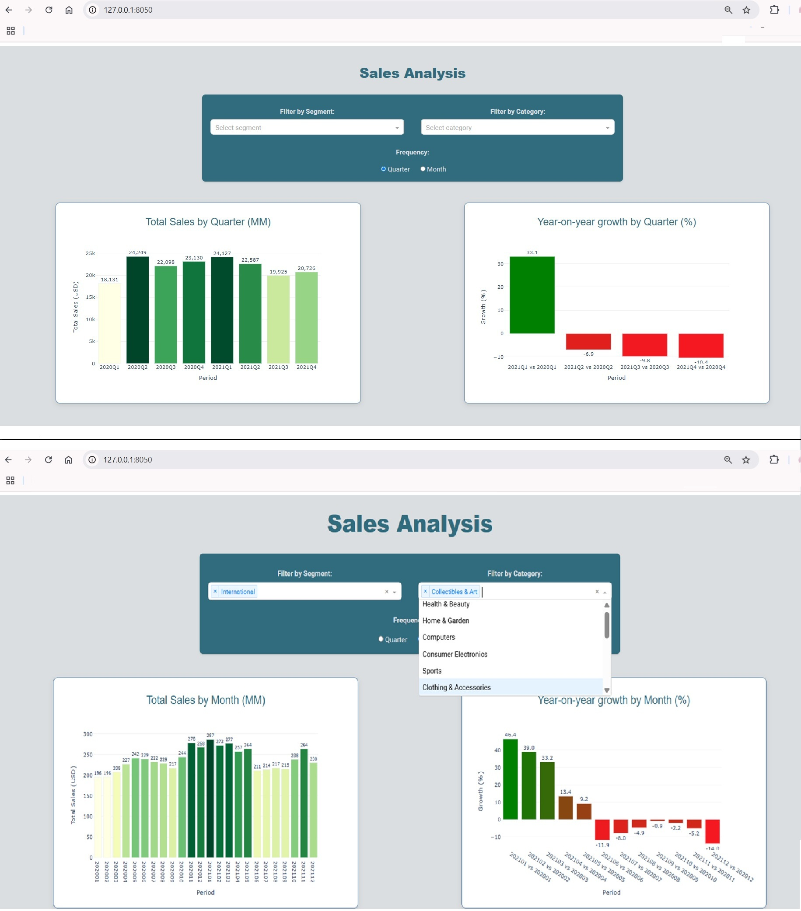

# Dashboard with Dash Plotly Analytics Sales
The challenge is to implement an nteractive web application for data visualization built with Dash (Python)

<a href="https://dash.plotly.com/" target="_blank">
  
</a>

## Table of Contents
- [Getting Started](#getting-started)
  - [Prerequisites](#prerequisites)
  - [Installation](#installation)
- [Project Structure](#project-structure)
- [Usage](#usage)

## Getting Started

### Prerequisites

- Python 3.8+
- pip package manager
- Git (optional for cloning)

### Installation

1. Download the Zip Folder:
```bash
- Open bash and search the folder downloaded
- cd Plotly_Analytics
```
2. Set up a virtual environment (recommended):

```bash
python -m venv venv
or
py -m venv venv

# Windows:
.\venv\Scripts\activate
or 
./venv/Scripts/activate
# Linux/MacOS:
source venv/bin/activate
```
3. Install dependencies:
```bash
pip install -r requirements.txt
```

## Project Structure
```bash
    sales-analysis-dash/
    ├── app.py                  # Application entry point
    ├── src/                    # Sources of the app
    │   ├── __init__.py
    │   ├── app_instance.py     # Main Dash app configuration
    │   ├── callbacks.py        # Callbacks for visualizations
    │   ├── get_data.py         # Data preprocessing
    │   └── layouts.py          # Layouts of the app
    ├── assets/                 # Static files (CSS, fonts)
    │   ├── styles.css  
    │   └── fonts/
    ├── data/
    │   ├── dataset.csv
    ├── EXPLAIN.md              # File explaining the approach
    ├── README.md               # This file
    └── requirements            # Dependencies
```
## Usage
```bash
python app.py
or
py app.py
```


